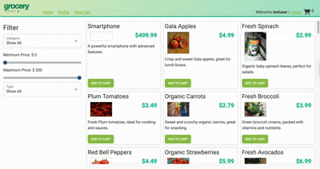
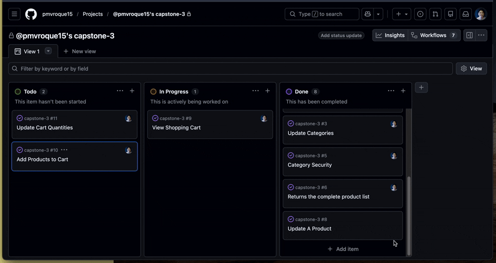
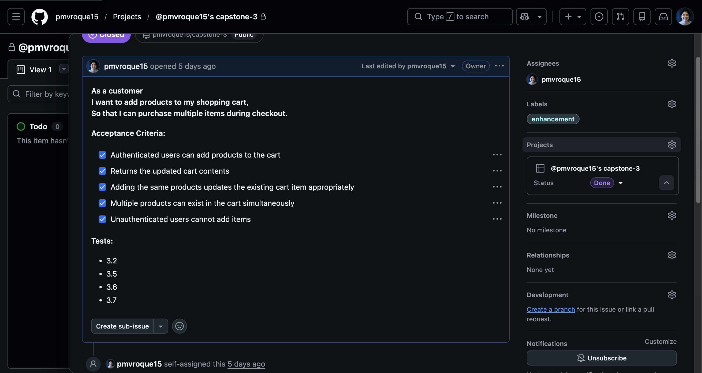

# Pat's Online Grocery Store  🛒

---
## Table Of Contents

- [Overview](#overview)
- [Features](#features)
- [Technology Stack](#technology-stack-)
- [Project Board](#project-board)
- [What Would I Improve On](#what-would-i-improve-on-)
- [Author](#author)
- [Resources](#resources)
- [Acknowledgements](#acknowledgements)
---
### Overview

This full-stack e-commerce application is built using Java, Spring boot, JavaScript, and MySQL. API endpoints are developed and tested using Insomnia, while mySQL serves as the application's relational database.

---

### Features



|               User               |       Administrator        |
|:--------------------------------:|:--------------------------:|
|   View products by category *    |     Add new categories     |
| Filter products by price range * |  Edit existing categories  |
|      View profile details *      |     Delete categories      |
|     Update profile details *     |                            |

**`*`** = Both authorized users can use the feature.

---

### Technology Stack 

- Backend: 
- Frontend: 
- Database: 
- API Testing: 
--- 

### Favorite code

During development, I noticed that I was repeatedly writing the same code whenever I needed to access the logged-in user's ID. In the ShoppingCartController, each endpoint required a Principal object to identify the authenticated user, retrieve the username, look up the corresponding user record, and obtain the user's ID.

Because this logic was duplicated across multiple methods, I refactored it into the service layer by creating a helper method that extracts the user ID from the Principal. This reduced code duplication, improved readability, and made the controller's responsibility more focused on handling HTTP requests while delegating business logic to the service layer. 

```java
 public ResponseEntity<ShoppingCart> getCart(Principal principal) 
```

I thought that it was redundant, so instead doing it in the Controller, I passed the principal to the ShoppingCartService class to get the ID:

```java
    public int getUserId(Principal principal) {

        String userName = principal.getName();
        User user = userService.getByUserName(userName);

        return user.getId();
    }
```

and I think it was a great way to keep from dry and keeping the Controller doing some business logic when the Service layer does the business logic.

---

### Project Board

Another thing I am proud also was I made a project board to experience how this feature works.


And here's a little snippet of what my ticket and the user story looked like:



---

### What would I improve on 
Hmm... 


I really enjoyed working on this project because it gave me a deeper understanding of what happens behind the scenes in a web application. It provided an opportunity to read and analyze code line by line, helping me better understand the architecture of Spring Boot REST applications and how the different layers work together.

From a backend perspective, I am satisfied with the application's functionality and architecture. However, if I were to continue improving the project, I would focus on enhancing the user interface to create a more modern, polished, and user-friendly experience.

---

### Author
Hi, I’m Pat Roque, an aspiring software developer passionate about learning and growing in the tech space. With a background in customer experience and leadership, I bring strong communication and problem-solving skills into my development journey. I’m currently focused on Java, building applications and expanding my knowledge of programming fundamentals.

Built with lots of brain cells and mooskels by a developer who takes both their gains and their grocery shopping skills seriously (ᕗ ͠° ਊ ͠° )ᕗ ᕙ(⇀‸↼‶)ᕗ

---

### Resources

Sehjal, H. (n.d.). User story template [GitHub Gist]. GitHub. https://gist.github.com/hamitsehjal/9871106a8cffaa16f0b2a70e20abe29b

Spring Framework Documentation – Transaction Management in the TestContext Framework
Spring Team. (n.d.). Transaction management. In Spring Framework Reference Documentation. Retrieved June 24, 2026, from https://docs.spring.io/spring-framework/reference/testing/testcontext-framework/tx.html#testcontext-tx-attribute-support

---

### Acknowledgements

I would like to express my sincere gratitude to David for being an incredible instructor throughout this bootcamp. Thank you for your patience, guidance, and encouragement every step of the way. Your passion for teaching and willingness to help us understand challenging concepts made a lasting impact on my learning journey.

This bootcamp has been one of the most rewarding experiences I've had. I not only gained valuable technical skills but also learned how to think like a developer, solve problems, and keep pushing through challenges. Looking back at where I started and where I am now, I'm proud of how much I've grown.

To my classmates, thank you for making this experience memorable. I'll truly miss learning, collaborating, and overcoming obstacles together.

Thank you, David, for believing in us and helping us build a strong foundation for our careers. This is only the beginning, and I'll always be grateful for everything I learned during this journey.