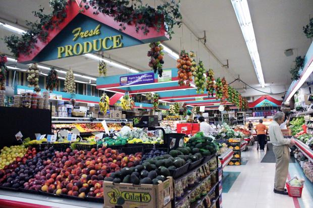

# Pat's Online Grocery Store  🛒

---
## Table Of Contents

- [Overview](#overview)
- [Features](#features)
- [Technology Stack](#technology-stack-)
- []
---
### Overview

This full-stack e-commerce application is built using Java, Spring boot, JavaScript, and MySQL. Api endpoints are developed and tested using Insomnia, while mySQL serves as the application's relational database.

---

### Features

**User Features**

- View products by category 
- Filter products by price range
- View profile details
- Update profile details 

**Administrator Features**

- Add new categories
- Edit existing categories
- Delete categories

# NOTE IMPORTANT !!!
**ADD GIF OR PHOTO FOR EXAMPLE**

---

### Technology Stack 

- Backend: Java, Spring Boot 
- Frontend: JavaScript
- Database: MySQL
- API Testing: Insomnia

--- 

